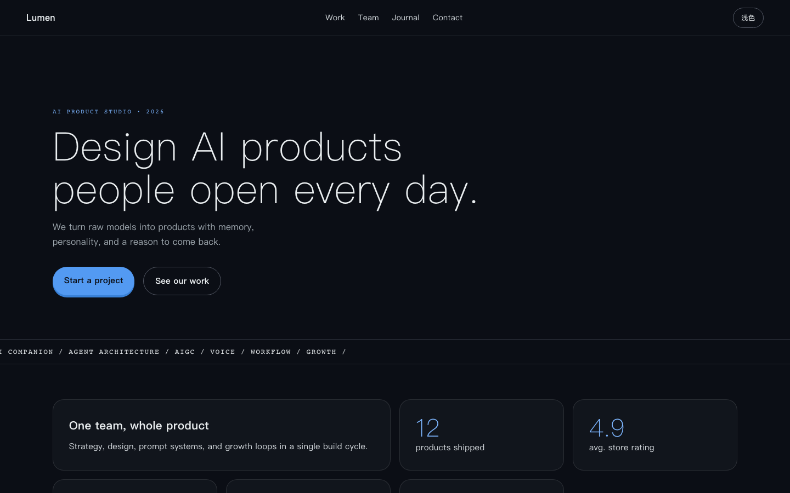
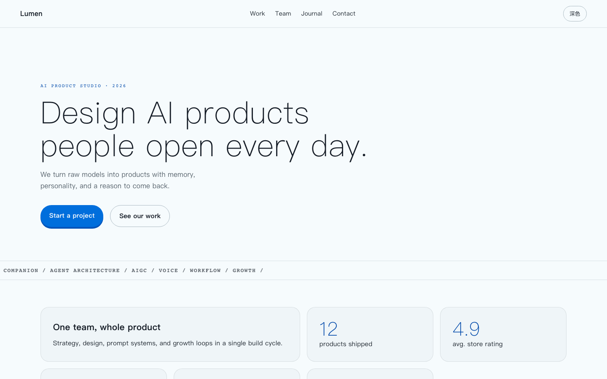
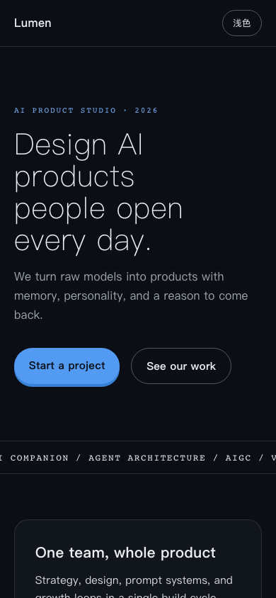

# Premium Website Design

[中文版](README.zh-CN.md) · [日本語](README.ja.md) · [한국어](README.ko.md) · [Español](README.es.md) · [Français](README.fr.md)

A Codex skill that designs distinctive, production-grade personal websites, portfolios, and landing pages end-to-end: direction, tokens, typography, tactile interactions, generative artwork, light/dark themes, QA verification, and deploy readiness.

**Live demo built with this skill:** https://mengjin-site.pages.dev

## Gallery

Example output rendered by the skill (fictional demo content, not a real site):

| Dark theme | Light theme | Mobile |
| --- | --- | --- |
|  |  |  |

The demo source lives in `assets/demo/index.html` and uses the starter token system.

## What it does

1. **Design Read** - infer audience and brief, set variance / motion / density dials
2. **Direction** - one committed aesthetic, no AI-slop defaults
3. **Tokens & skeleton** - OKLCH dark-first theme system with light overrides
4. **Interactions** - character entrance, cursor spotlight, 3D tilt, magnetic buttons, scroll-linked rails, marquee, aurora, theme toggle
5. **Artwork** - seeded generative art (no API key required) or AI avatar pipeline with privacy rules
6. **Icons** - auto-search and fetch icons from Iconify / Simple Icons / iconfont with a fail-closed verification checklist
7. **Verification & deploy** - preflight checklist, Playwright QA, Cloudflare Pages config

## Install

Inside Codex, ask to install the skill from this repository, or copy it into your skills directory:

```bash
cp -r premium-website-design ~/.codex/skills/
```

## Usage

Once installed, Codex loads the skill automatically when you ask for a personal site, portfolio, landing page, or redesign. Example prompts:

```text
Design a premium personal website for an AI product director.
Redesign my portfolio with strong interactions and a light/dark toggle.
Build a landing page that does not look templated.
```

## Contents

```text
SKILL.md                      Core workflow
references/preflight.md       Release gate checklist
references/interactions.md    Motion recipes with code
references/art-pipeline.md    Generative art + avatar + privacy
references/icons.md           Icon sourcing + verification
assets/tokens.css             Starter design tokens
scripts/qa_site.py            Generic Playwright verification
agents/openai.yaml            UI metadata
```

## License

MIT
