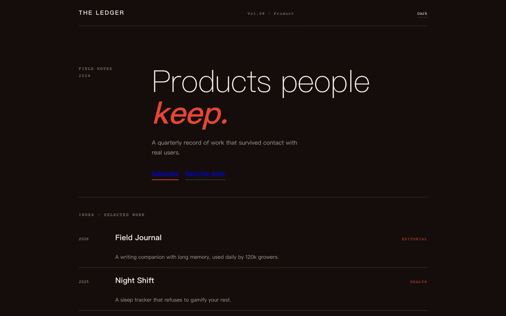
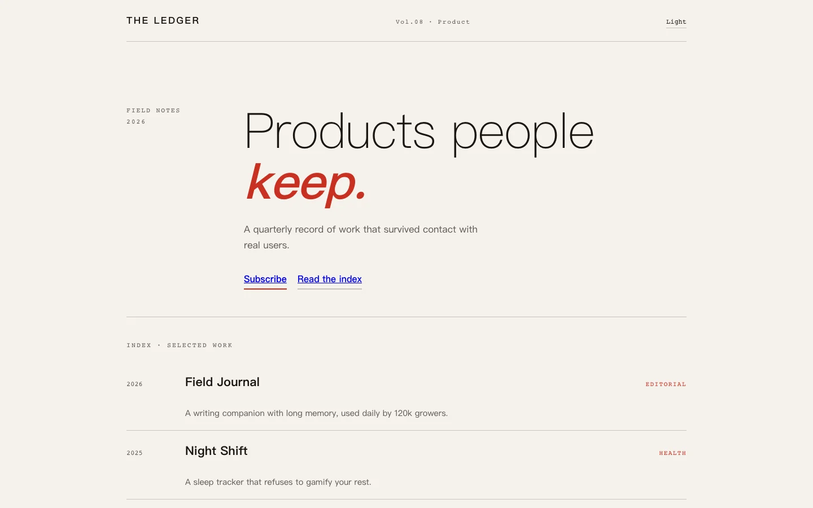
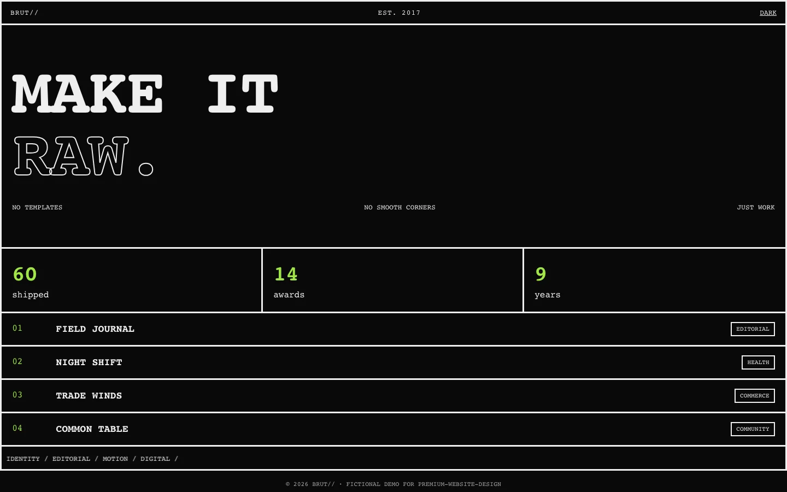
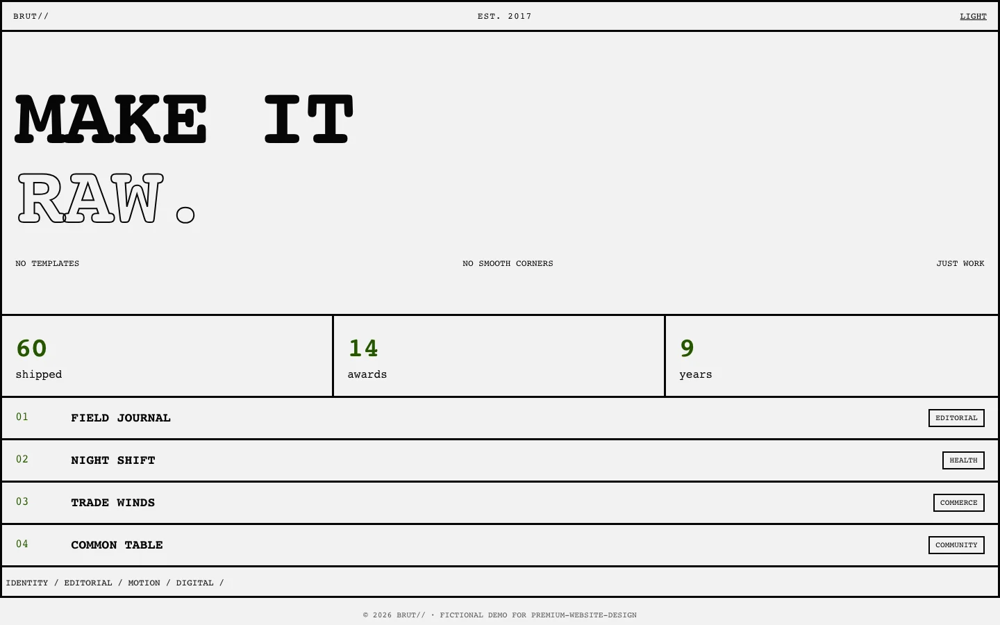
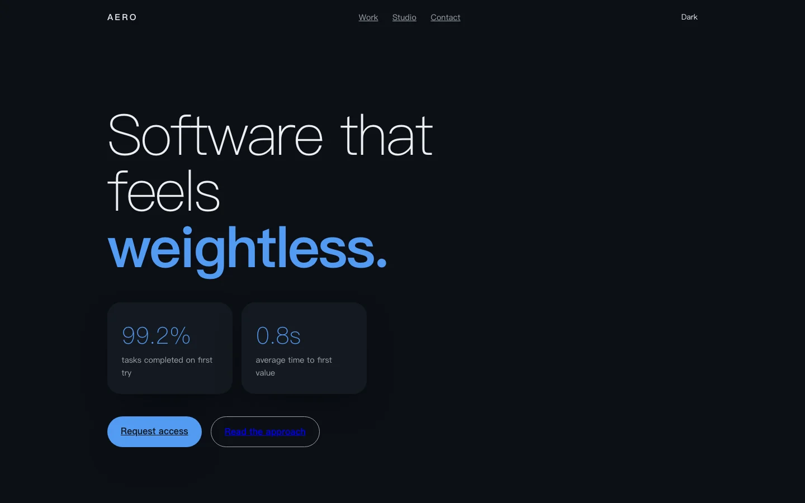
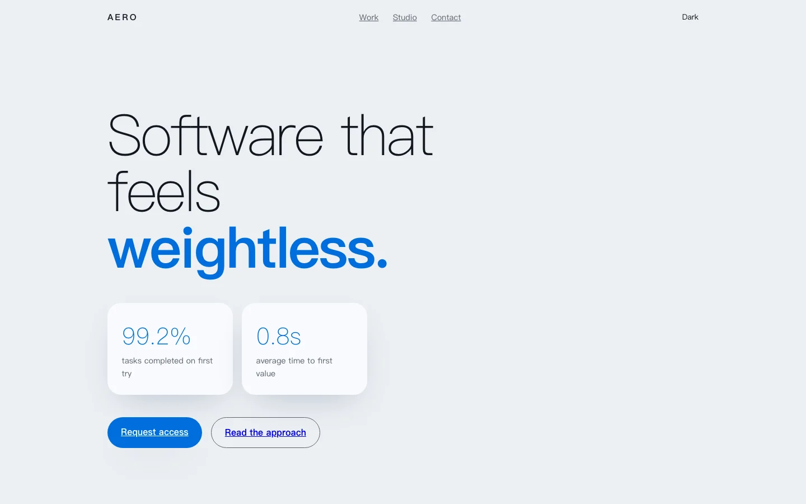

# Premium Website Design


[中文版](README.zh-CN.md) · [日本語](README.ja.md) · [한국어](README.ko.md) · [Español](README.es.md) · [Français](README.fr.md)

**A Codex skill that designs distinctive, production-grade personal websites, portfolios, and landing pages end-to-end — without the template look.**

**Live demo built with this skill:** https://mengjin-site.pages.dev

## Why this skill

- **No AI-slop defaults.** Every project starts with a design read and a committed direction, not a purple gradient and three equal cards.
- **Privacy-first by default.** Year-only dates, no phone numbers, generated avatars instead of real photos, and a scan before every release.
- **Shipped, not mocked.** Preflight checklist, Playwright QA, contrast checks, and a Cloudflare Pages recipe are part of the workflow.

## Gallery

All screenshots are fictional demo content.

### Layout styles

| Style | Dark | Light |
| --- | --- | --- |
| Bento Grid · Lumen |  |  |
| Editorial Magazine · The Ledger |  |  |
| Brutalist · BRUT// |  |  |
| Soft Structural · AERO |  |  |

### Color directions

| Palette | Dark | Light |
| --- | --- | --- |
| Forest · Moss |  |  |
| Mono Cherry · Noir |  |  |
| Terracotta Slate · Atelier Terra |  |  |

Mobile layout: 

Demo sources live in `assets/demo/`, each with its own layout and token system.

## What it does

1. **Design Read** - infer audience and brief, set variance / motion / density dials
2. **Direction** - one committed aesthetic, no AI-slop defaults
3. **Tokens & skeleton** - OKLCH dark-first theme system with light overrides
4. **Interactions** - character entrance, cursor spotlight, 3D tilt, magnetic buttons, scroll-linked rails, marquee, aurora, theme toggle
5. **Artwork** - free watermark-free generation (SiliconFlow Kolors) + free vision review (GLM-4V-Flash), seeded generative art without any API, or an AI avatar pipeline with privacy rules
6. **Icons** - auto-search and fetch icons from Iconify / Simple Icons / iconfont with a fail-closed verification checklist
7. **Verification & deploy** - preflight checklist, Playwright QA, Cloudflare Pages config

## Quick start

Install into your skills directory:

```bash
cp -r premium-website-design ~/.codex/skills/
```

Or ask Codex directly:

```text
Install the skill from https://github.com/akqwpeter-prog/premium-website-design
```

Then use it:

```text
Design a premium personal website for an AI product director.
Redesign my portfolio with strong interactions and a light/dark toggle.
Build a landing page that does not look templated.
```

## Contents

```text
SKILL.md                      Core workflow
references/preflight.md       Release gate checklist
references/interactions.md    Motion recipes with code
references/art-pipeline.md    Generative art + avatar + privacy
references/icons.md           Icon sourcing + verification
assets/tokens.css             Starter design tokens
assets/demo/                  Fictional demos: layouts + palettes
scripts/qa_site.py            Generic Playwright verification
agents/openai.yaml            UI metadata
```

## Contributing

Bug reports, ideas, and pull requests are welcome. Open an [issue](https://github.com/akqwpeter-prog/premium-website-design/issues) or submit a PR — every contribution helps the skill get better.

## License

MIT
