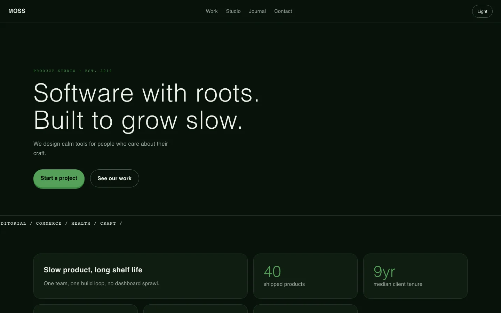
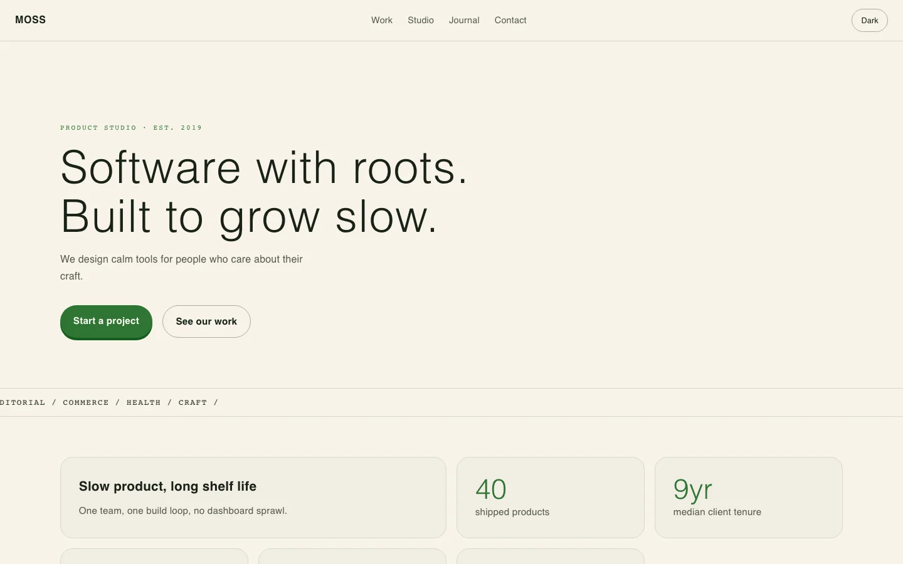
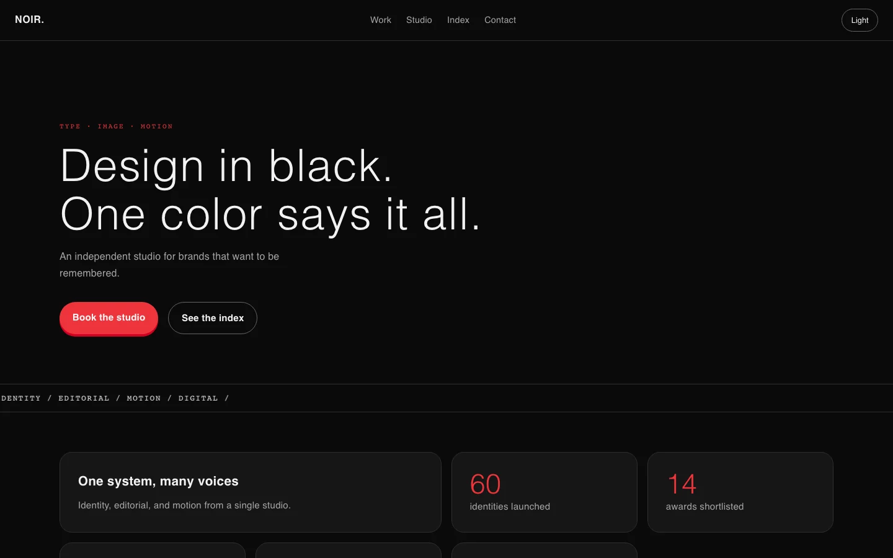
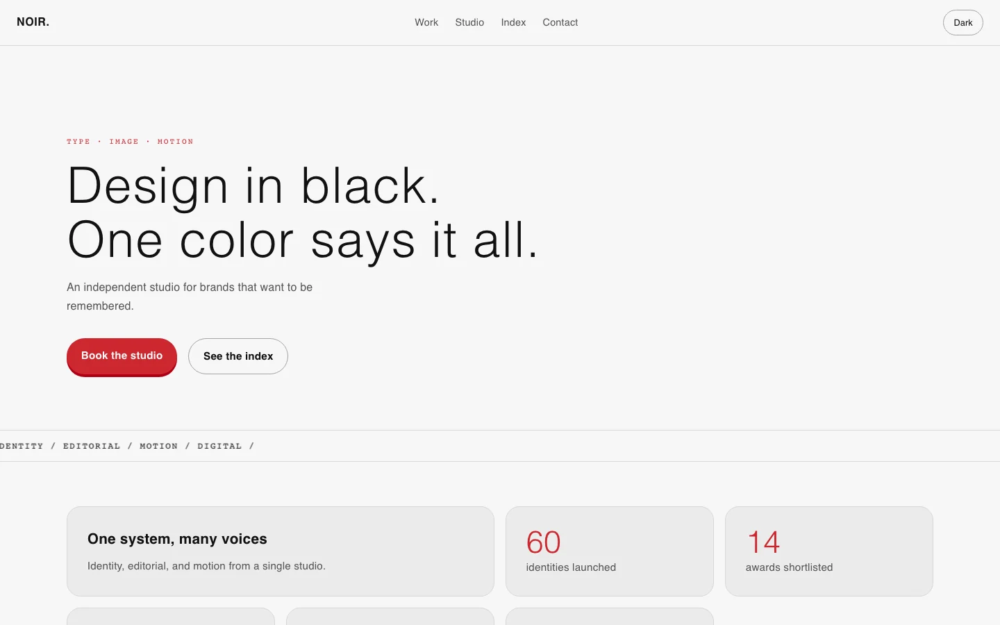
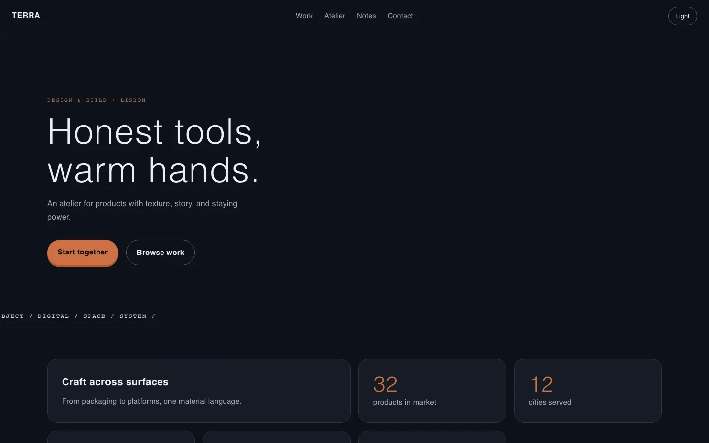
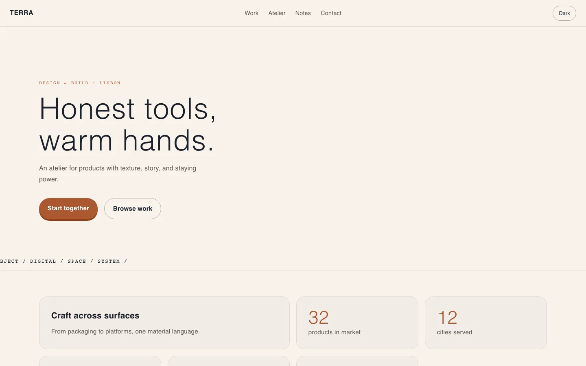

# Premium Website Design（高级网站设计技能）

[English](README.md) · [日本語](README.ja.md) · [한국어](README.ko.md) · [Español](README.es.md) · [Français](README.fr.md)

一个 Codex 技能，用于端到端设计有辨识度、可上线的个人网站、作品集和落地页：方向判断、设计令牌、排版、触感交互、生成式插画、浅色/深色主题、QA 验收和部署配置。

**用本技能完成的线上案例：** https://mengjin-site.pages.dev

## 效果图

技能渲染的 4 种风格方向（均为虚构演示内容）：

| 风格 | 深色 | 浅色 |
| --- | --- | --- |
| 钴蓝墨 · Lumen |  |  |
| 森林绿 · Moss |  |  |
| 单色樱桃红 · Noir |  |  |
| 陶土石板灰 · Atelier Terra |  |  |

移动端布局：

示例源码位于 `assets/demo/`，每个示例使用各自的设计令牌。

## 它能做什么

1. **设计阅读** - 推断受众与需求，设定 变化度/动效强度/视觉密度 三个拨盘
2. **方向** - 只做一个明确的美学方向，避开 AI 模板味
3. **令牌与骨架** - OKLCH 深色优先主题系统，带浅色覆盖
4. **交互** - 字符入场、卡片聚光、3D 倾斜、磁吸按钮、滚动时间轴、跑马灯、极光、主题切换
5. **生图** - 可复现的生成艺术（无需 API Key），或 AI 头像流程（含隐私规则）
6. **图标** - 从 Iconify / Simple Icons / iconfont 自动搜索获取图标，并带「确认使用是否正确」的校验清单
7. **验收与部署** - 预检清单、Playwright QA、Cloudflare Pages 配置

## 安装

在 Codex 中要求安装本仓库的技能，或复制到技能目录：

```bash
cp -r premium-website-design ~/.codex/skills/
```

## 使用示例

```text
为一位 AI 产品总监设计一个高级个人网站。
重设计我的作品集，加入强交互和深浅色切换。
做一个不像模板的落地页。
```

## 目录

```text
SKILL.md                      核心工作流
references/preflight.md       发布门槛清单
references/interactions.md    交互配方与代码
references/art-pipeline.md    生成艺术 + 头像 + 隐私
references/icons.md           图标获取 + 校验
assets/tokens.css             设计令牌模板
scripts/qa_site.py            通用 Playwright 验收
agents/openai.yaml            UI 元数据
```

## 许可证

MIT
